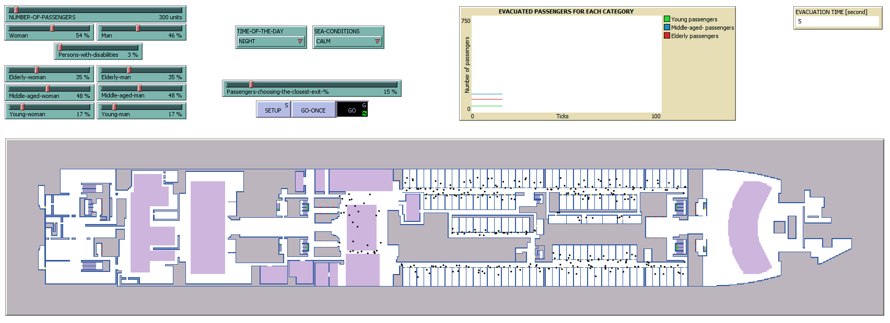
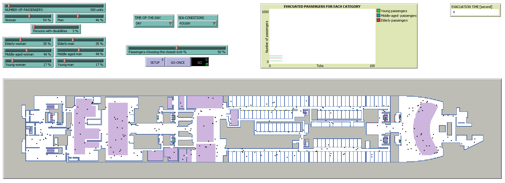
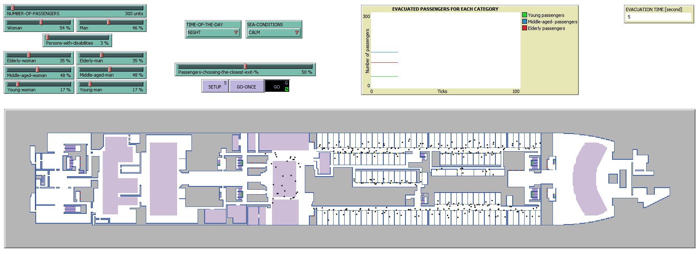
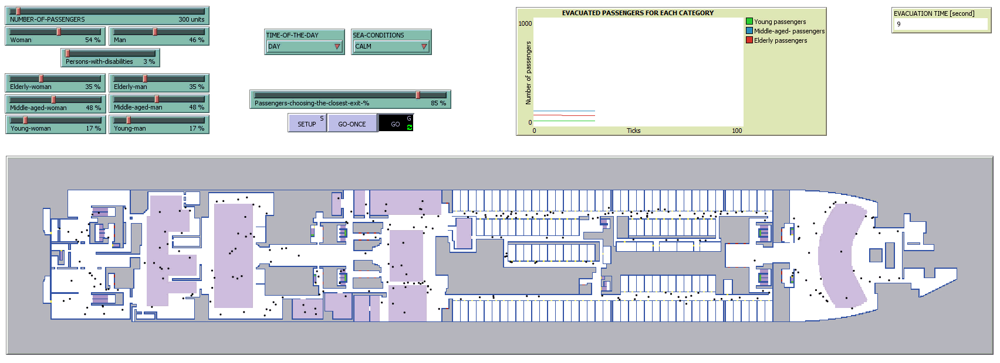
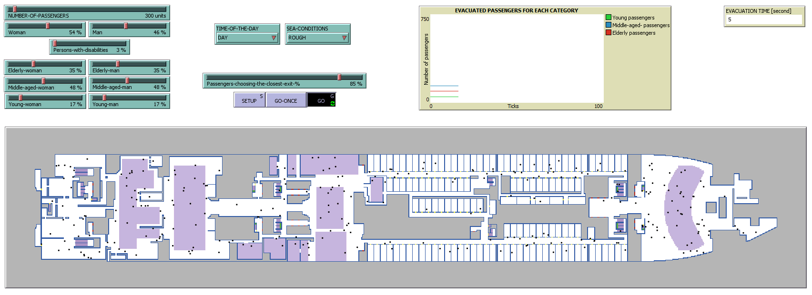
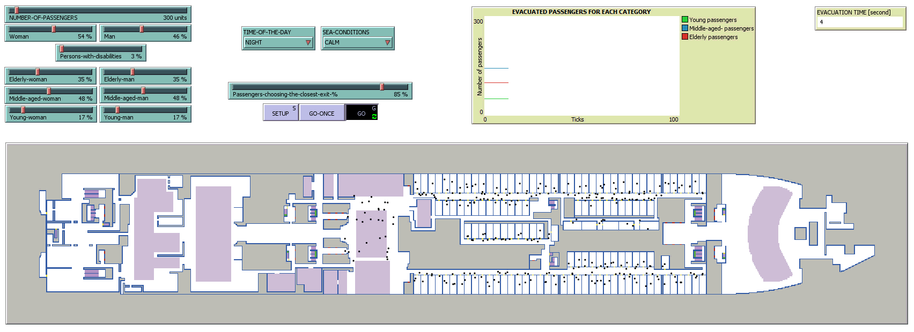

Recordings of the simulations presented in the paper
### **"An Agent-based Model for Cruise Ship Evacuation Considering the Presence of Smart Technologies on Board"** 
submitted to the `Simulation Modelling Practice and Theory` journal. 

Please feel free to contact us at liviu.cotfas at ase .ro for further details. 

## Simulations

> Suggestion: You can download the animations below in order to watch them at a higher resolution.

### Event 1 - Scenario 1

#### no. of passengers: 300 

#### no. of passengers: 600

### Event 1 - Scenario 2

#### no. of passengers: 300 

#### no. of passengers: 600

### Event 1 - Scenario 3

#### no. of passengers: 300 

### Event 2 - Scenario 1

#### no. of passengers: 300 

#### no. of passengers: 600

### Event 2 - Scenario 2

#### no. of passengers: 300 

#### no. of passengers: 600

### Event 2 - Scenario 3

#### no. of passengers: 300 

### Event 3 - Scenario 1

#### no. of passengers: 300 

#### no. of passengers: 600

### Event 3 - Scenario 2

#### no. of passengers: 300 

#### no. of passengers: 600

### Event 3 - Scenario 3

#### no. of passengers: 300 
